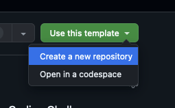
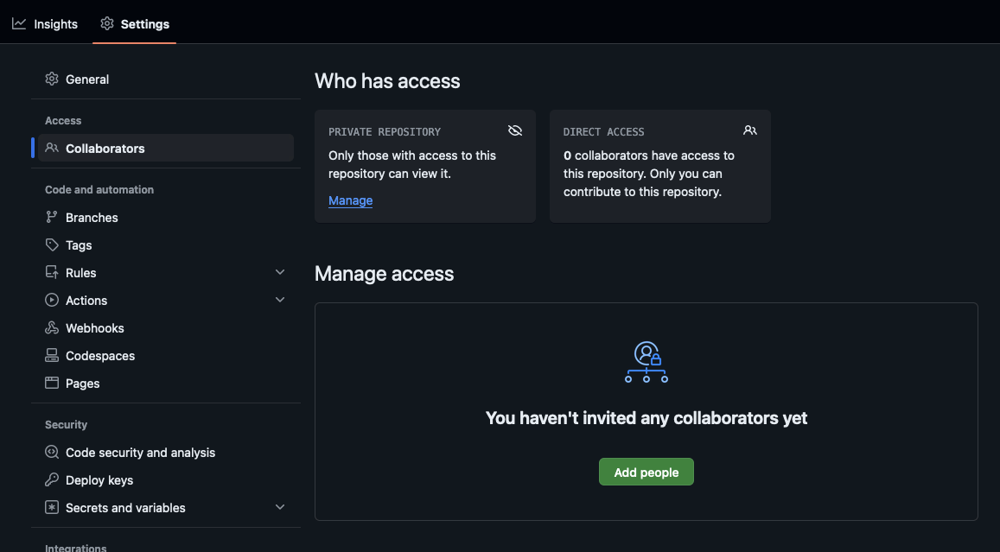

## Getting Started

Welcome to the Task Manager coding challenge, in this challenge you will be tasked with building a simple Task Management Application that allows users to create, update delete, and view tasks.

Already scaffolded for you is a NextJS app with the following integrations:

- Prisma ORM with SQLite
- Nexus (GraphQL schema generation)
- Apollo Server
- Apollo Client
- GraphQL Code Generator (for apollo client requests


---

### Clone this repo

Start off by cloning this repo using the "Use this template" button at the top right and create a new **private** repo:



In the settings of your new private repo, invite `tomwhale` as a collaborator.



---

### Prerequisites

- Node v20 is recommended.

---

### NPM

Kick off with an npm install

```
npm i
```

---

### Prisma

Migrate and seed your db

```
npx prisma migrate dev --name init
```

---

### Generate API types

(Note: `npm run dev` runs this as a pre-step)

Generate your API types (remember to re-run these if you make any changes to your schema)

```
npm run generate
```

---

### Run

Run the NextJS dev server

```
npm run dev
```

App can be viewed here: http://localhost:3000

The GraphQL api can be viewed here: http://localhost:3000/api/graphql

---

### Generate FE types

(Note: Run this in a separate terminal tab/window, as this requires `npm run dev` to be running)

Generate your front-end types (remember to re-run these if you make any changes to your schema)

```
npm run codegen
```

---

### Instructions

Initial tasks are provided in `prisma/seed.ts`

There may be some bugs and you are also free to change any configuration if you want to.

Feel free to use libraries that you are most comfortable with.
